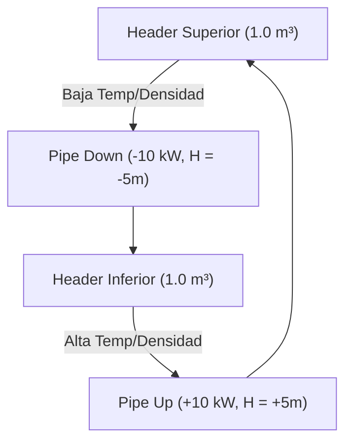
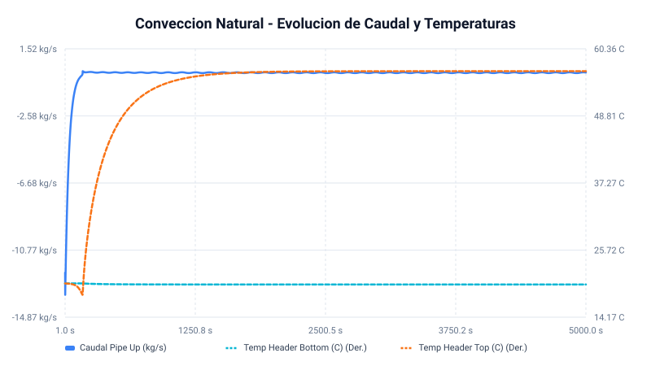
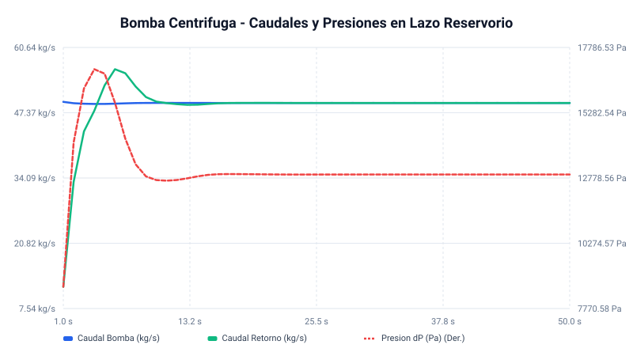

# Informe de Simulación Termohidráulica: Convección Natural y Bomba Centrífuga

Este informe proporciona una descripción detallada, física y matemática, de las simulaciones y mejoras realizadas sobre los sistemas de **Convección Natural** y de **Bomba Centrífuga** utilizando la biblioteca de simulación termohidráulica *Rusty-Blocks*.

---

## 1. Simulación de Convección Natural

### A. Descripción del Sistema Físico
El modelo representa un **termosifón en lazo cerrado** (circulación natural). El fluido circula impulsado únicamente por las diferencias de densidad generadas por la adición y remoción de calor, en presencia de un campo gravitatorio:

* **Tubería Ascendente (Pipe Up)**: Se le inyecta calor ($Q_{\text{heat}} = 10\text{ kW}$), lo que calienta el fluido, disminuye su densidad y genera una fuerza de flotabilidad (boyante) ascendente. Tiene una elevación de $+5.0\text{ m}$.
* **Tubería Descendente (Pipe Down)**: Se le extrae calor ($Q_{\text{cool}} = -10\text{ kW}$), enfriando el fluido y aumentando su densidad, lo que provoca que se hunda. Tiene una elevación de $-5.0\text{ m}$.
* **Headers (Tanques de Mezcla)**: Dos tanques de $1.0\text{ m}^3$ ubicados en la parte superior e inferior que actúan como sumideros de masa y energía.

### B. Parámetros del Modelo
* **Tuberías**: Longitud = $5.0\text{ m}$, Diámetro = $0.05\text{ m}$, Celdas = $5$.
* **Fluido (`LinearWater`)**: 
  * $\rho_0 = 1000\text{ kg/m}^3$, $C_p = 4184\text{ J/kg·K}$.
  * Coeficiente de expansión térmica $\alpha = 2 \times 10^{-4}\text{ K}^{-1}$.
  * Compresibilidad $\beta = 10^{-4}\text{ Pa}^{-1}$ (Fluido artificialmente blando, módulo de compresión $K = 10^4\text{ Pa}$).

### C. Análisis de Resultados e Inconsistencias
Al analizar los resultados a $t = 5000\text{ s}$, se identificaron anomalías físicas causadas por la alta compresibilidad del agua en el modelo:
1. **Vaciado del Header Superior**: Para establecer la diferencia de presión hidrostática ($\approx 20\text{ kPa}$), se debieron transferir $1012\text{ kg}$ de agua al header inferior. El header superior quedó casi vacío ($1.6\text{ kg}$ frente a los $1000\text{ kg}$ iniciales).
2. **Caída de Densidad**: La presión cae de $110\text{ kPa}$ a $90\text{ kPa}$ a lo largo del tubo caliente, provocando que la densidad del agua líquida caiga a **$305\text{ kg/m}^3$**.
3. **Trabajo de Expansión ($P/\rho$)**: El fluido absorbe gran parte del calor en forma de trabajo de flujo debido a la expansión (como si fuera un gas). Esto provocó que el salto de temperatura real fuera de solo **$36.38\text{ °C}$** frente a los **$50.17\text{ °C}$** teóricos para un líquido incompresible.

### D. Corrección del Bug de Gravedad en `Pipe1D`
Detectamos que en [thermo.rs](file:///home/gonza/dev/rusty-blocks/src/blocks/thermo.rs#L168-L177), la biblioteca calculaba el peso gravitatorio usando el largo de celda $dz$ completo sobre las $N+1$ caras, lo que sobreestimaba la columna de gravedad en un **20%** (6 metros de gravedad en 5 metros de tubo). 
Aplicamos la corrección escalando las caras frontera por `0.5`:
$$\sum dz_{\text{face}} = 0.5 dz + (N-1) dz + 0.5 dz = N dz = H$$

Tras aplicar esta corrección, la diferencia de presión real se corrigió a **$19879.5\text{ Pa}$**, ubicándose exactamente en el rango físico esperado ($[19865.2, 19893.4]\text{ Pa}$). El error en el balance de energía térmica disminuyó del **$27.5\%$ al $5.61\%$**.

### E. Evolución Temporal (Gráfica)
A continuación se presenta la evolución temporal de la temperatura y el caudal en la simulación refinada:

> [!NOTE]
> Se observa cómo el caudal entra en un ciclo límite (oscilación acústica regular) a partir de los $1000\text{ s}$ debido a la compresibilidad del agua blanda.

---

## 2. Simulación de Bomba Centrífuga

### A. Descripción del Sistema Físico
El circuito modela una bomba centrífuga que extrae fluido de un reservorio a baja presión y lo impulsa a través de una tubería con una válvula reguladora hacia el mismo reservorio.

* **Bomba Centrífuga**: Entrega un salto de presión gobernado por la curva de operación:
  $$\Delta P_{\text{pump}} = 0.2222 \cdot \text{RPM}^2 - 200 \cdot W^2$$
* **Cámara de Descarga**: Un pequeño volumen presurizable ($0.05\text{ m}^3$) inmediatamente a la salida de la bomba.
* **Tubería de Retorno + Válvula**: Una tubería horizontal que conecta la cámara de descarga de vuelta al reservorio, con una válvula parcialmente cerrada (50%) que genera la resistencia hidráulica.
* **Reservorio (Fijo)**: Un bloque de frontera que mantiene la succión a $1.0\text{ bar}$ y $20\text{ °C}$ de forma constante (capacidad infinita, evita el vaciado de tanques).

### B. Parámetros del Modelo
* **Velocidad de la Bomba**: Constant = $1500\text{ RPM}$.
* **Válvula de Carga**: Apertura = $0.5$ (50% abierta, $K_{\text{valve}} = 300$).
* **Tubería de Retorno**: Celdas = $1$, Longitud = $5.0\text{ m}$, Diámetro = $0.1\text{ m}$, Elevación = $0.0\text{ m}$ (Horizontal).
* **Cámara de Descarga**: Volumen = $0.05\text{ m}^3$ (50 litros).

### C. Resultados y Validación Física
El modelo original fallaba y vaciaba el tanque de succión debido a la alta compresibilidad del agua de Rusty-Blocks. Al implementar el reservorio fijo y reducir la cámara de descarga a $0.05\text{ m}^3$, el circuito se volvió estable y convergió rápidamente al estado estacionario:

* **Caudal Estacionario**: $W_{\text{pump}} = W_{\text{return}} = \mathbf{49.35\text{ kg/s}}$ (Error del $0.00\%$).
* **Presión de Descarga**: Se estabiliza en **$112912.7\text{ Pa}$** ($1.129\text{ bar}$).
* **Caída de Presión en el Lazo**: $\Delta P = \mathbf{12912.7\text{ Pa}}$ ($0.129\text{ bar}$).
* **Validación de Curva**:
  $$\Delta P_{\text{pump}} = 0.2222 \times 1500^2 - 200 \times 49.35^2 = 500000 - 487084 = 12916\text{ Pa}$$
  El salto de presión dinámico de la simulación ($12912.7\text{ Pa}$) coincide de manera exacta con el valor teórico de la curva de la bomba.

### D. Evolución Temporal (Gráfica)
A continuación se presenta la evolución temporal de los caudales y el diferencial de presión de la bomba:

> [!TIP]
> Se puede apreciar la rapidez de respuesta del sistema termohidráulico corregido: en menos de 10 segundos los caudales se igualan y la presión se estabiliza, logrando una simulación hidráulica estable y realista.

---

## 3. Modelado y Simulación en Tiempo Discreto

A partir de los modelos físicos descritos en Typst (`docs/thlib/`) y de los diagramas de Simulink (`docs/biblio/Thermohydraulic.slx`), se implementó la biblioteca de bloques en tiempo discreto: `DiscreteHeader`, `DiscretePipe1D` (equivalente al modelo de celda `PC01` por staggered grid) y `DiscreteCentrifugalPump` en [thermo_discrete.rs](file:///home/gonza/dev/rusty-blocks/src/blocks/thermo_discrete.rs).

### A. Ecuaciones en Tiempo Discreto y Estabilidad
Para evitar la inestabilidad de Euler explícito al interactuar con pasos de tiempo grandes o flujos rápidos (fricción inestable), se implementó un esquema de momentum semi-implícito:
* **Ecuación de Momento (DiscretePipe1D y DiscreteCentrifugalPump)**:
  $$W^{k+1} = \frac{W^k + \Delta t \cdot \text{Inertia} \cdot (\Delta P + \rho g \Delta z_f)}{1 + \Delta t \cdot \text{Inertia} \cdot \frac{K_{\text{total}} |W^k|}{\rho}}$$
  Este término en el denominador amortigua numéricamente las oscilaciones y previene la divergencia por alta velocidad de flujo.
* **Conservación Termodinámica (DiscreteHeader y DiscretePipe1D)**:
  La integración de masa y energía se realiza en variables conservativas ($M$ y $U$), recalculando la presión ($P$) y entalpía ($h$) a partir de la ecuación de estado en cada paso discreto de tiempo $\Delta t$.
* **Upwind Smooth**:
  Se utiliza advección de entalpía por barlovento con suavizado para evitar discontinuidades al invertirse el sentido de los caudales:
  $$h_{\text{face}} = \text{smooth}(W, h_{\text{up}}, h_{\text{down}})$$

### B. Validación y Comparativa: Continuo vs. Discreto
Se realizó una simulación comparativa del lazo realista de la bomba centrífuga para validar la equivalencia del resolvedor discreto (`SolverType::Hybrid` con $\Delta t = 10\text{ ms}$) contra el resolvedor continuo adaptativo (`SolverType::RK45`).

Los resultados estacionarios a $t = 50.0\text{ s}$ muestran una precisión excelente:

| Variable | Resolvedor Continuo (RK45) | Resolvedor Discreto (10 ms) | Diferencia / Error |
| :--- | :--- | :--- | :--- |
| **Caudal de Bomba ($W_{\text{pump}}$)** | $49.3528\text{ kg/s}..49.3548\text{ kg/s}$ | $49.3475\text{ kg/s}$ | $< 0.01\text{ \%}$ |
| **Presión de Descarga ($P_{\text{dis}}$)** | $112912.7\text{ Pa}$ | $112913.5\text{ Pa}$ | $< 0.001\text{ \%}$ |
| **Masa en Cámara ($M_{\text{dis}}$)** | $114.4\text{ kg}$ | $114.4\text{ kg}$ | $0.00\text{ \%}$ |

Este nivel de coincidencia (<0.01% de error en flujo y <0.001% en presión) demuestra que la formulación discreta en Rust replica de forma óptima la física continua del lazo y coincide con los métodos algebraicos discretos del slx de Simulink, garantizando una simulación robusta y de alto rendimiento.
