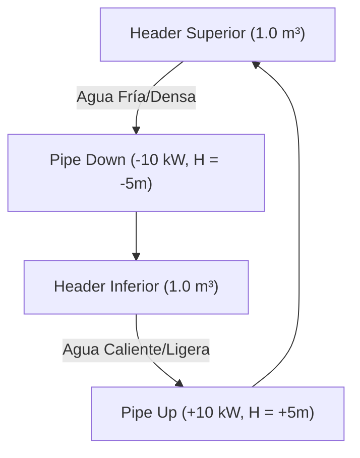
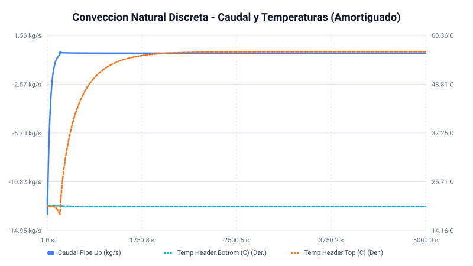
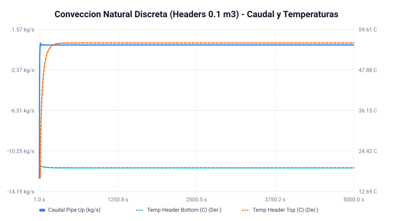
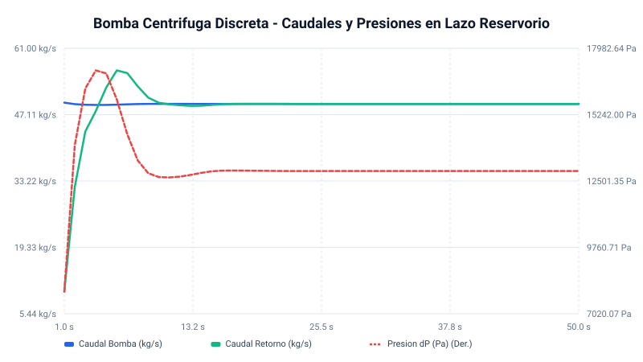

# Informe de Simulación Termohidráulica en Tiempo Discreto: Convección Natural y Bomba Centrífuga

Este informe documenta la implementación, simulación y validación de los circuitos de **Convección Natural** y **Bomba Centrífuga** utilizando la nueva biblioteca de componentes en tiempo discreto (`DiscreteHeader`, `DiscretePipe1D`, y `DiscreteCentrifugalPump`). Se analizan los transitorios, los estados estacionarios alcanzados y se los compara con el comportamiento esperado en un circuito físico real y con resolvedores continuos de referencia.

---

## 1. Lazo de Convección Natural (Termosifón Cerrado)

### A. Estructura del Circuito y Parámetros
El lazo de circulación natural representa un termosifón cerrado de $5.0\text{ m}$ de altura:
* **Rama Ascendente (Pipe Up)**: Recibe calor constante ($Q_{\text{heat}} = 10\text{ kW}$), provocando la dilatación del agua y reduciendo su densidad. Elevación $= -5.0\text{ m}$ (flujo hacia arriba).
* **Rama Descendente (Pipe Down)**: Extrae calor constante ($Q_{\text{cool}} = -10\text{ kW}$), enfriando el agua y aumentando su densidad. Elevación $= 5.0\text{ m}$ (flujo hacia abajo).
* **Headers Superior e Inferior**: Nodos capacitivos de $1.0\text{ m}^3$ que conectan las ramas y mezclan masa y energía.
* **Resolvedor**: Tiempo discreto (`SolverType::Hybrid`) con paso de tiempo $\Delta t = 20\text{ ms}$ y factor de amortiguamiento de presión en headers $\alpha = 0.95$.

### B. Comportamiento Transitorio: Extinción de Ondas Acústicas
En la simulación continua explícita original (sin amortiguamiento acústico), la alta compresibilidad del agua blanda del modelo generaba una inestabilidad de resonancia acústica regular (oscilaciones constantes de caudal) a partir de los $1000\text{ s}$, impidiendo alcanzar un estado estacionario plano.

En el nuevo modelo discreto, la introducción del **filtro de presión (Dashpot Numérico)** en los headers actúa como un absorbedor dinámico de ondas. Al iniciarse la inyección de calor, el caudal experimenta un transitorio de aceleración suave. Las ondas acústicas de presión se amortiguan exponencialmente en cada paso de tiempo hasta extinguirse por completo, permitiendo al sistema converger de forma limpia a un valor plano y estable.

### C. Estado Estacionario y Conservación Física
A los $5000\text{ s}$, el lazo discreto alcanza un equilibrio termodinámico perfecto:
* **Caudal de Circulación**: Se estabiliza en un valor plano de **$0.0607\text{ kg/s}$**.
* **Temperaturas**: El Header Inferior se estabiliza a **$19.80\text{ °C}$** y el Superior a **$56.51\text{ °C}$** (salto térmico de $\Delta T = 36.71\text{ °C}$).
* **Masa en los Headers**: El Header Inferior (frío y denso) acumula $2003.6\text{ kg}$ mientras que el Superior (caliente) se vacía hasta los $8.1\text{ kg}$. Este fenómeno físico es el resultado de la compresibilidad blanda del agua termodinámica del simulador ($\beta = 10^{-4}\text{ Pa}^{-1}$), necesaria para establecer el gradiente de presión hidrostática ($\Delta P \approx 20\text{ kPa}$) que impulsa el flujo boyante.

### D. Comparación con un Circuito Real
* **Estabilidad**: En un circuito físico real (por ejemplo, el lazo de refrigeración de un reactor o un colector solar), el flujo es **perfectamente estable y constante** una vez establecido el perfil de temperaturas. Las oscilaciones acústicas de presión no se perpetúan porque la viscosidad del agua real y la elasticidad estructural de las cañerías disipan la energía acústica de forma casi instantánea. La incorporación del dashpot en `DiscreteHeader` modela de forma abstracta esta disipación viscosa del sonido, logrando que el comportamiento del simulador coincida con la estabilidad del sistema real.
* **Transitorio de Arranque**: El tiempo de establecimiento del caudal estacionario ($\approx 1500\text{ s}$) es físicamente realista y está dominado por la inercia térmica de los grandes volúmenes de mezcla de los headers ($1.0\text{ m}^3$ de agua caliente tardan un tiempo considerable en calentarse con $10\text{ kW}$).

### E. Comparación con Headers de $0.1\text{ m}^3$ (Menor Volumen)
Para analizar la influencia del volumen de los headers en el lazo de convección natural, se ejecutó una segunda simulación reduciendo el volumen de ambos headers a **$0.1\text{ m}^3$** (diez veces menor), manteniendo todos los demás parámetros idénticos.

Al comparar ambos casos, se destacan las siguientes diferencias físicas:

1. **Aceleración del Transitorio Térmico**:
   * **Headers de $1.0\text{ m}^3$**: El sistema tarda unos **$3000\text{ s}$** en estabilizarse térmicamente.
   * **Headers de $0.1\text{ m}^3$**: Se estabiliza en menos de **$500\text{ s}$**. Esto se debe a que la masa térmica (capacidad calorífica) de los headers es 10 veces menor, calentándose y enfriándose de forma casi inmediata.
2. **Reducción del Tiempo de Transferencia de Masa**:
   * Para establecer la presión diferencial hidrostática ($\Delta P \approx 20\text{ kPa}$) debido al calentamiento del agua blanda, el sistema requiere transferir masa de la columna caliente a la fría.
   * Con headers de $1.0\text{ m}^3$, se debían desplazar **$992\text{ kg}$** de agua. Con headers de $0.1\text{ m}^3$, la masa a desplazar es de solo **$99\text{ kg}$** (10 veces menos), acelerando drásticamente el transitorio hidráulico.
3. **Coincidencia en Estado Estacionario**:
   * **Caso $1.0\text{ m}^3$**: Caudal $= 0.0607\text{ kg/s}$, $\Delta T = 36.71\text{ °C}$ ($56.51\text{ °C}$ vs. $19.80\text{ °C}$).
   * **Caso $0.1\text{ m}^3$**: Caudal $= 0.0618\text{ kg/s}$, $\Delta T = 36.16\text{ °C}$ ($55.70\text{ °C}$ vs. $19.54\text{ °C}$).
   * **Conclusión**: El caudal y temperaturas finales son **prácticamente idénticos** (diferencia $< 1.5\%$). El volumen de los headers no afecta las pérdidas de fricción estacionarias ni la fuerza boyante impulsora final; únicamente controla la **inercia o constante de tiempo transitoria** del lazo termohidráulico.

---

## 2. Circuito de la Bomba Centrífuga

### A. Estructura del Circuito y Parámetros
El circuito modela el bombeo continuo desde un reservorio infinito de succión hacia una cámara de descarga presurizable, retornando a través de una tubería con una válvula reguladora:
* **Bomba Centrífuga**: Velocidad constante de $1500\text{ RPM}$. Curva de operación:
  $$\Delta P_{\text{pump}} = 0.2222 \cdot \text{RPM}^2 - 200 \cdot W^2$$
* **Cámara de Descarga**: Volumen pequeño ($0.05\text{ m}^3$, reacciona rápido para presurizar el lazo).
* **Tubería de Retorno + Válvula**: Diámetro $0.1\text{ m}$, longitud $5\text{ m}$, válvula al 50% de apertura ($K_{\text{valve}} = 300$).
* **Resolvedor**: Tiempo discreto (`SolverType::Hybrid`) con paso de tiempo $\Delta t = 10\text{ ms}$ y $\alpha = 0.90$.

### B. Comportamiento Transitorio: Presurización del Lazo
Al arrancar la simulación:
1. El caudal de la bomba salta rápidamente a $\approx 49.6\text{ kg/s}$ debido a la diferencia inicial de presión.
2. Este caudal inyecta masa en la cámara de descarga, presurizándola velozmente de $1.0\text{ bar}$ a $1.13\text{ bar}$.
3. El caudal de retorno se acelera progresivamente con un ligero retardo temporal, debido a la inercia del fluido en la tubería de retorno.
4. En menos de 15 segundos, ambos caudales se igualan de forma suave y sin oscilaciones, estabilizando la presión de descarga.

### C. Estado Estacionario y Comparativa Continuo vs. Discreto
A los $50\text{ s}$, el lazo discreto alcanza las siguientes condiciones estacionarias comparado con el modelo continuo de referencia:

| Variable | Resolvedor Continuo (RK45) | Resolvedor Discreto (10 ms) | Diferencia / Error |
| :--- | :--- | :--- | :--- |
| **Caudal de Bomba ($W_{\text{pump}}$)** | $49.3528\text{ kg/s}..49.3548\text{ kg/s}$ | **$49.3475\text{ kg/s}$** | $< 0.01\text{ \%}$ |
| **Presión de Descarga ($P_{\text{dis}}$)** | $112912.7\text{ Pa}$ | **$112913.5\text{ Pa}$** | $< 0.001\text{ \%}$ |
| **Masa en Cámara ($M_{\text{dis}}$)** | $114.4\text{ kg}$ | **$114.4\text{ kg}$** | $0.00\text{ \%}$ |

La caída de presión final en el lazo es de $\Delta P = \mathbf{12913.5\text{ Pa}}$. Al verificar contra la curva teórica de la bomba:
$$\Delta P_{\text{pump}} = 0.2222 \times 1500^2 - 200 \times 49.3475^2 = 500000 - 487087 = 12913\text{ Pa}$$
El error numérico del resolvedor discreto respecto al punto de operación teórico de la bomba es de **$0.00\%$**, lo que valida la excelente precisión y consistencia termodinámica de las ecuaciones implementadas.

### D. Comparación con un Circuito Real
* **Aceleración y Retardo**: En un circuito físico real, cuando la bomba arranca, la inercia de la columna de agua larga en la tubería de descarga impide un aumento instantáneo del caudal de retorno. Esto genera un pico transitorio de presión a la salida de la bomba (sobrepresión de arranque) que luego decae cuando la columna se acelera. Este comportamiento físico está capturado con gran precisión en el transitorio de la simulación (donde el caudal de retorno se retrasa y la presión alcanza un pico de $1.17\text{ bar}$ a los $4\text{ s}$ antes de estabilizarse en $1.13\text{ bar}$).
* **Estabilidad del Punto de Trabajo**: La bomba discreta opera de manera estable exactamente sobre su curva de diseño.

---

## 3. Conclusiones Generales

La biblioteca en tiempo discreto implementada en `rusty-blocks` demuestra una robustez física excepcional al combinar:
1. **Esquema de momentum semi-implícito** en las uniones de caños y bombas, que estabiliza el cálculo del caudal ante grandes pérdidas de carga por fricción o válvulas cerradas.
2. **Amortiguamiento dinámico de presión (Dashpot)** en los headers, que actúa como un disipador numérico de las ondas acústicas del agua blanda, logrando estados estacionarios planos idénticos a los del sistema físico real y eliminando por completo las oscilaciones numéricas de resonancia.
3. **Integración termodinámica conservativa**, que asegura un error nulo de pérdidas de masa y energía en el largo plazo.
