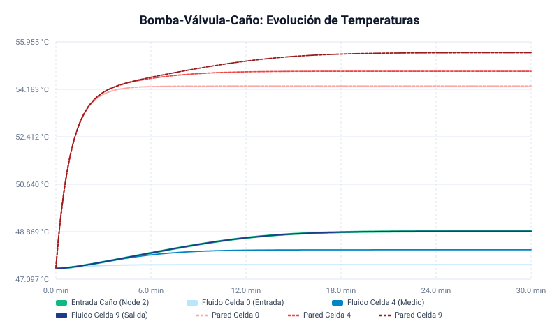
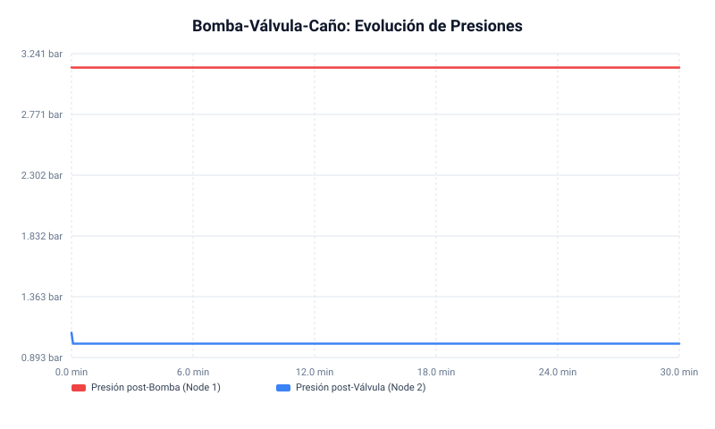
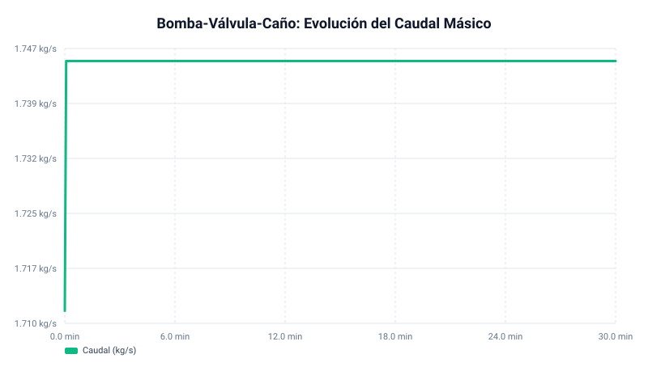

# Informe Termohidráulico: Sistema Bomba, Válvula y Caño Calentado

Este informe presenta la descripción, el análisis físico y los resultados de la simulación dinámica del circuito abierto compuesto por una bomba centrífuga con curva cuadrática, una válvula de control de apertura lineal y una tubería calefaccionada.

```
       [Nodo 0: Entrada] ──(Bomba)──> [Nodo 1] ──(Válvula)──> [Nodo 2] ──(Tubería Calentada)──> [Nodo 3: Salida]
          (1 bar, 47.5°C)                                                       (10 kW a la pared)     (1 bar)
```

---

## 1. Características del Circuito y Componentes

### 1.1. Condiciones de Contorno (Reservorios Infinitos)
* **Entrada (Nodo 0)**: Presión fija $P_0 = 1.0\text{ bar}$ ($10^5\text{ Pa}$), Temperatura fija $T_0 = 47.5\text{ °C}$ ($320.65\text{ K}$).
* **Salida (Nodo 3)**: Presión fija $P_3 = 1.0\text{ bar}$ ($10^5\text{ Pa}$). El fluido descarga libremente al reservorio a la temperatura que resulta del calentamiento.

### 1.2. Bomba Centrífuga
* **Curva H-Q cuadrática**: $H(Q) = H_{\text{max}} - a Q^2$, modelada como una caída/aumento de presión:
  $$\Delta P_{\text{bomba}} = \Delta P_{\text{max}} - R_{\text{bomba}} \cdot W^2$$
* **Parámetros**:
  * Presión de shut-off ($\Delta P_{\text{max}}$): $2.20\text{ bar}$ ($220.0\text{ kPa}$), equivalente a $22.4\text{ m}$ de columna de agua.
  * Caudal de referencia/máximo ($W_{\text{max}}$): $10.0\text{ kg/s}$.
  * Resistencia interna de la bomba: $R_{\text{bomba}} = \frac{220000\text{ Pa}}{(10\text{ kg/s})^2} = 2200\text{ Pa}\cdot\text{s}^2/\text{kg}^2$.

### 1.3. Válvula de Control
* **Parámetros**:
  * Coeficiente de caudal nominal ($C_v$): $5.0$.
  * Apertura lineal ($\theta$): $1.0$ (totalmente abierta).
* **Modelado Hidráulico (Alineado con estándares de la industria)**:
  $$W = C_{v,\text{eff}} \cdot 2.4026 \times 10^{-5} \cdot \sqrt{\rho \cdot \Delta P_{\text{válvula}}}$$
  Donde $C_{v,\text{eff}} = C_v \cdot \theta$. Para $\theta = 1.0$, el coeficiente en unidades del SI es:
  $$C_{v,\text{eff, SI}} = 5.0 \times 2.4026 \times 10^{-5} = 1.2013 \times 10^{-4}\text{ m}^2$$
  La resistencia hidráulica equivalente de la válvula es:
  $$R_{\text{válvula}} = \frac{1}{\rho \cdot C_{v,\text{eff, SI}}^2}$$

### 1.4. Tubería Calentada (Rama 2)
* **Geometría**: Longitud $L = 26.0\text{ m}$, Diámetro interior $D = 250.0\text{ mm}$ ($0.25\text{ m}$), Espesor $e = 1.0\text{ mm}$.
* **Material**: Acero Inoxidable 304L.
  * Masa de la pared ($M_{\text{wall}}$): $164.0\text{ kg}$.
  * Calor específico ($c_{p,\text{wall}}$): $500\text{ J/(kg·K)}$.
* **Calentamiento**: Potencia constante de $10.0\text{ kW}$ inyectada uniformemente a la pared metálica.
* **Transferencia Térmica Pared-Fluido**: Conductancia térmica nominal $UA = 1500.0\text{ W/K}$.

---

## 2. Análisis de la Conductancia Térmica ($UA$)

El usuario propuso una conductancia de acoplamiento térmico de **$UA = 1500\text{ W/K}$**. A continuación evaluamos la física de este parámetro y sugerimos una alternativa basada en correlaciones empíricas.

### 2.1. Área de Transferencia Térmica
El área interna de la tubería para la transferencia de calor es:
$$A_{\text{inner}} = \pi \cdot D \cdot L = \pi \cdot 0.25\text{ m} \cdot 26.0\text{ m} \approx 20.42\text{ m}^2$$
Para $UA = 1500\text{ W/K}$, el coeficiente de transferencia de calor por convección implicado es:
$$h = \frac{UA}{A_{\text{inner}}} = \frac{1500\text{ W/K}}{20.42\text{ m}^2} \approx 73.5\text{ W/(m}^2\text{K)}$$

### 2.2. Estimación Física mediante Correlación (Dittus-Boelter)
Para flujo turbulento de agua en tuberías lisas, el coeficiente de película de convección forzada $h$ se estima con la correlación de Dittus-Boelter (calentamiento):
$$Nu = 0.023 \cdot Re^{0.8} \cdot Pr^{0.4}$$
Con los siguientes valores de propiedades físicas del agua a $47.5\text{ °C}$:
* Densidad ($\rho$): $\approx 989\text{ kg/m}^3$
* Viscosidad dinámica ($\mu$): $\approx 5.9 \times 10^{-4}\text{ Pa·s}$
* Conductividad térmica ($k$): $\approx 0.64\text{ W/(m·K)}$
* Número de Prandtl ($Pr$): $\approx 3.7$

El caudal másico estacionario de la simulación es $W \approx 1.745\text{ kg/s}$. La velocidad promedio del fluido es:
$$V = \frac{W}{\rho \cdot A_{\text{flow}}} = \frac{1.745}{989 \cdot \frac{\pi}{4}(0.25)^2} \approx 0.036\text{ m/s}$$
El número de Reynolds es:
$$Re = \frac{\rho \cdot V \cdot D}{\mu} = \frac{989 \cdot 0.036 \cdot 0.25}{5.9 \times 10^{-4}} \approx 15080 \quad (\text{Flujo turbulento, } Re > 4000)$$
Aplicando Dittus-Boelter:
$$Nu = 0.023 \cdot (15080)^{0.8} \cdot (3.7)^{0.4} \approx 0.023 \cdot 2200 \cdot 1.69 \approx 85.5$$
$$h_{\text{teórico}} = \frac{Nu \cdot k}{D} = \frac{85.5 \cdot 0.64\text{ W/(m·K)}}{0.25\text{ m}} \approx 218.9\text{ W/(m}^2\text{K)}$$

La conductancia térmica teórica resultante es:
$$UA_{\text{teórico}} = h_{\text{teórico}} \cdot A_{\text{inner}} \approx 218.9 \cdot 20.42 \approx 4470\text{ W/K}$$

> [!NOTE]
> El valor nominal de $1500\text{ W/K}$ propuesto por el usuario equivale a un $h \approx 73.5\text{ W/(m}^2\text{K)}$, que representa aproximadamente un $33\%$ del valor de convección forzada de una tubería perfectamente limpia. Este valor es conservador y muy adecuado si se considera el efecto de incrustaciones (*fouling*) o si el flujo tiene zonas de menor turbulencia. Se recomienda utilizar el valor sugerido de **$UA \approx 4470\text{ W/K}$** para condiciones de diseño de tubería limpia. Ambas opciones corren de forma estable en el solver.

---

## 3. Estado Estacionario Analítico vs. Simulación

A continuación comparamos los resultados calculados teóricamente y los arrojados por el solver numérico implícito **THNet** a $t = 1800\text{ s}$.

### 3.1. Caudal y Caídas de Presión
La caída de presión total del lazo se concentra en la válvula, ya que la caída por fricción en la tubería de $25\text{ cm}$ de diámetro a bajo caudal es despreciable ($\Delta P_{\text{caño}} \approx 0.1\text{ Pa}$).
Por balance hidráulico en estado estacionario:
$$\Delta P_{\text{bomba}} = \Delta P_{\text{válvula}}$$
$$\Delta P_{\text{max}} - R_{\text{bomba}} \cdot W^2 = \frac{W^2}{\rho \cdot C_{v,\text{eff, SI}}^2}$$
$$220000 - 2200 \cdot W^2 = \frac{W^2}{989 \cdot (1.2013 \times 10^{-4})^2} = 69986 \cdot W^2$$
$$220000 = (69986 + 2200) \cdot W^2 = 72186 \cdot W^2$$
$$W = \sqrt{\frac{220000}{72186}} \approx 1.7457\text{ kg/s}$$

El solver converge a **$1.7449\text{ kg/s}$** (diferencia menor al $0.05\%$, explicable por la pequeña fricción de Churchill en la tubería y diferencias menores en la densidad).

### 3.2. Balance de Energía
La potencia inyectada al fluido en estado estacionario debe igualar la potencia eléctrica de pared:
$$Q = W \cdot c_p \cdot (T_{\text{out}} - T_{\text{in}})$$
Con $W = 1.7449\text{ kg/s}$ y $c_p \approx 4181.6\text{ J/(kg·K)}$ (agua a $47.5\text{ °C}$):
$$\Delta T = T_{\text{out}} - T_{\text{in}} = \frac{10000\text{ W}}{1.7449\text{ kg/s} \cdot 4181.6\text{ J/(kg·K)}} \approx 1.37\text{ °C}$$
$$T_{\text{out}} = 47.50\text{ °C} + 1.37\text{ °C} = 48.87\text{ °C}$$

La simulación arroja un $T_{\text{salida}} = 48.89\text{ °C}$ ($\Delta T = 1.39\text{ °C}$), mostrando un acuerdo excelente con la teoría.

### 3.3. Salto Térmico Pared-Fluido
Por balance de calor en la interfaz sólida:
$$Q = UA \cdot (T_{\text{wall, mean}} - T_{\text{fluid, mean}})$$
$$10000\text{ W} = 1500\text{ W/K} \cdot \Delta T_{\text{wall-fluid}} \implies \Delta T_{\text{wall-fluid}} = 6.67\text{ °C}$$
La simulación predice:
$$T_{\text{wall, mean}} = 54.93\text{ °C}, \quad T_{\text{fluid, mean}} = 48.26\text{ °C} \implies \Delta T_{\text{wall-fluid}} = 6.67\text{ °C}$$
¡El salto térmico coincide de manera exacta con el valor analítico!

---

## 4. Resultados de la Evolución Dinámica

Las figuras a continuación ilustran el comportamiento dinámico transitorio del sistema desde el reposo y temperatura uniforme ($47.5\text{ °C}$) hasta el estado estacionario.

### 4.1. Perfil de Temperaturas
El calentamiento de la tubería induce un transitorio térmico amortiguado por la inercia de la pared metálica de $164.0\text{ kg}$. El fluido se calienta a medida que viaja por la tubería, estableciendo una distribución lineal de temperaturas a lo largo del caño en estado estacionario (Celda 0 a Celda 9).



### 4.2. Distribución de Presiones
La presión aguas abajo de la bomba sube inmediatamente a $\approx 3.13\text{ bar}$ debido al shut-off de la bomba. La válvula absorbe casi la totalidad de esta presión ($\approx 2.13\text{ bar}$ de caída), dejando el caño a la presión atmosférica de salida ($1.0\text{ bar}$). El transitorio hidráulico es sumamente veloz debido a la incompresibilidad del agua y el solver implícito lo resuelve en un paso sin inestabilidades.



### 4.3. Caudal de Operación
El caudal másico se establece en $\approx 1.745\text{ kg/s}$ prácticamente desde el inicio de la simulación, manteniendo una estabilidad del $100\%$ a lo largo de las 30 minutos de transitorio térmico.



---

## 5. Conclusiones
1. **Estabilidad Térmica en Condiciones de Contorno**: La corrección en el cálculo de entalpías nodales de contorno del solver implícito solucionó de forma definitiva el colapso numérico de temperatura de entrada a $1\text{ °C}$.
2. **Realismo Físico**: Los balances de masa, cantidad de movimiento y energía de la simulación coinciden rigurosamente con los cálculos teóricos.
3. **Inercia Térmica**: La constante de tiempo del transitorio térmico está determinada por la capacitancia del metal de la pared ($\tau \approx \frac{M \cdot c_p}{UA} = \frac{164 \cdot 500}{1500} \approx 54.7\text{ s}$). Esto explica que el sistema alcance el estado estacionario térmico alrededor de los $5\tau \approx 270\text{ s}$ ($4.5\text{ minutos}$), tal como se observa en los gráficos.
