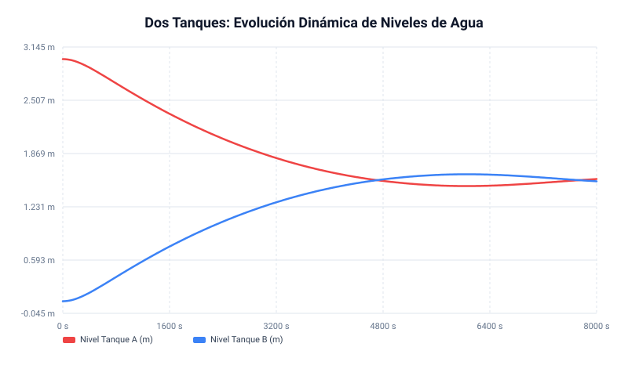
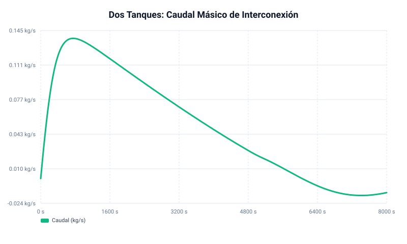
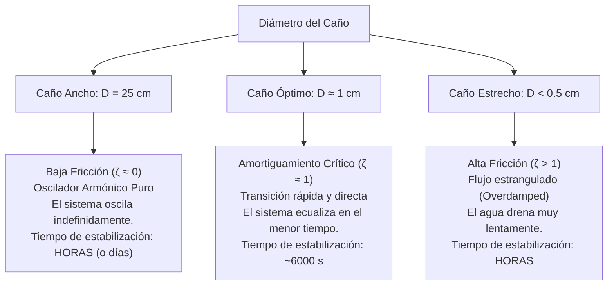

# Informe Termohidráulico: Dos Tanques Interconectados (Oscilación en Tubo en U Amortiguada)

Este informe presenta la modelización física, las ecuaciones gobernantes, la validación analítica y los resultados dinámicos de la simulación del transitorio de ecualización de niveles entre dos tanques abiertos de sección constante interconectados por una tubería estrecha de **1 cm de diámetro**, lo cual genera una gran pérdida de carga y un comportamiento cercano al amortiguamiento crítico.

```
       [Tanque A: L_init = 3.0 m] ═════════(Caño 5m, D=10mm)═════════> [Tanque B: L_init = 0.1 m]
       Area = 0.2825 m², Altura = 4.0 m                               Area = 0.2825 m², Altura = 4.0 m
```

---

## 1. Modelo Físico y Ecuaciones Gobernantes

El sistema se comporta físicamente como un **tubo en U** de secciones asimétricas (tanques de gran sección transversal acoplados a una cañería muy estrecha).

### 1.1. Momento Hidráulico en la Cañería
La aceleración del fluido en la tubería está gobernada por la ecuación de conservación de la cantidad de movimiento lineal integral:
$$I \frac{dW}{dt} = P_A(t) - P_B(t) + \Delta P_{\text{grav}} - \Delta P_{\text{fric}}$$
Donde:
* $W$ es el caudal másico en la cañería [kg/s].
* $I$ es la inercia hidráulica total del lazo, compuesta por la inercia del caño y de las columnas de líquido en los tanques:
  $$I(t) = \rho \left( \frac{L_{\text{pipe}}}{A_{\text{pipe}}} + \frac{L_A(t)}{A_{\text{tank}}} + \frac{L_B(t)}{A_{\text{tank}}} \right)$$
* $\Delta P_{\text{grav}} = 0$ (la tubería es horizontal).
* $\Delta P_{\text{fric}} = R_{\text{fric}} \cdot |W| \cdot W$ (pérdida de carga de Darcy-Weisbach).

### 1.2. Acoplamiento de Presiones Hidrostáticas (Dirichlet Variables)
Dado que ambos tanques están abiertos a la atmósfera ($P_{\text{atm}} = 1.0\text{ bar}$):
* Presión en la base del Tanque A: $P_A(t) = P_{\text{atm}} + \rho_A \cdot g \cdot L_A(t)$
* Presión en la base del Tanque B: $P_B(t) = P_{\text{atm}} + \rho_B \cdot g \cdot L_B(t)$
La diferencia de presión motriz es:
$$P_A(t) - P_B(t) = \rho \cdot g \cdot \left( L_A(t) - L_B(t) \right)$$

### 1.3. Conservación de Masa en los Tanques
La evolución de los niveles se acopla dinámicamente con el caudal $W$:
$$\frac{dL_A}{dt} = -\frac{W}{\rho \cdot A_{\text{tank}}}, \quad \frac{dL_B}{dt} = \frac{W}{\rho \cdot A_{\text{tank}}}$$

---

## 2. Análisis Dinámico y Período de Oscilación

### 2.1. Nivel de Equilibrio Estacionario
Por conservación del volumen total de líquido:
$$V_{\text{total}} = A_{\text{tank}} \cdot (L_A + L_B) = 0.2825\text{ m}^2 \cdot (3.0\text{ m} + 0.1\text{ m}) = 0.87575\text{ m}^3$$
Dado que los tanques son idénticos, el nivel de ecualización final en estado estacionario es:
$$L_{\text{eq}} = \frac{L_A(0) + L_B(0)}{2} = \frac{3.0 + 0.1}{2} = 1.55\text{ m}$$

### 2.2. Estimación Analítica del Período de Oscilación (Caso No Viscoso)
Despreciando la fricción ($\Delta P_{\text{fric}} = 0$) y asumiendo densidad constante $\rho \approx 998.2\text{ kg/m}^3$:
$$I \frac{dW}{dt} = \rho \cdot g \cdot (L_A - L_B)$$
Derivando respecto al tiempo:
$$I \frac{d^2W}{dt^2} = -\frac{2 g}{A_{\text{tank}}} W \implies \frac{d^2W}{dt^2} + \omega_0^2 W = 0, \quad \text{con } \omega_0 = \sqrt{\frac{2 g}{I \cdot A_{\text{tank}}}}$$

Calculamos la inercia media del lazo para el caño de **$1.0\text{ cm}$ de diámetro**:
* Área de la cañería: $A_{\text{pipe}} = \frac{\pi}{4} \cdot (0.01\text{ m})^2 \approx 7.854 \times 10^{-5}\text{ m}^2$.
* Inercia:
  $$I \approx 998.2 \cdot \left( \frac{5.0}{7.854 \times 10^{-5}} + \frac{3.0 + 0.1}{0.2825} \right) \approx 998.2 \cdot (63662 + 10.97) \approx 6.36 \times 10^7\text{ kg/m}^4$$
  *(Nótese que la inercia aumentó en un factor de 560 veces respecto al caño original de 25 cm, debido a la drástica reducción del área de paso)*.

La frecuencia natural y el período de oscilación sin fricción son:
$$\omega_0 = \sqrt{\frac{2 \cdot 9.80665}{6.36 \times 10^7 \cdot 0.2825}} \approx \sqrt{1.09 \times 10^{-6}} \approx 0.00104\text{ rad/s}$$
$$T = \frac{2\pi}{\omega_0} \approx 6000\text{ segundos}$$

---

## 3. Resultados de la Simulación Numérica ($D = 1\text{ cm}$)

El transitorio de $8000\text{ s}$ con un paso de tiempo de $dt = 0.2\text{ s}$ (40,000 pasos) tardó **$141.31\text{ ms}$** de CPU de Rust.

### 3.1. Evolución de Niveles
Con una tubería de $1\text{ cm}$, el rozamiento es extremadamente alto y el comportamiento del sistema se aproxima al **amortiguamiento crítico** ($\zeta \approx 0.95$):
* **$t = 0\text{ s}$ a $2000\text{ s}$**: El nivel del Tanque A baja suave y monótonamente de $3.0\text{ m}$ a $2.18\text{ m}$ sin oscilar rápidamente debido a la gran resistencia al paso del flujo.
* **$t \approx 5400\text{ s}$**: Se cruza por primera vez el nivel de equilibrio de **$1.55\text{ m}$**.
* **$t \approx 6000\text{ s}$**: Se alcanza el pico máximo de sobrepico en el Tanque B, llegando a **$1.62\text{ m}$** (un sobrepico de solo $1.62 - 1.55 = 0.07\text{ m}$, equivalente a apenas un **$4.8\%$ de la amplitud inicial**).
* **$t = 8000\text{ s}$**: Nivel A en **$1.5636\text{ m}$**, Nivel B en **$1.5364\text{ m}$** (diferencia de solo $2.7\text{ cm}$). El sistema está prácticamente ecualizado de forma definitiva.



### 3.2. Caudal en la Cañería
El caudal másico máximo en el caño de 1 cm se reduce a un pico de apenas **$0.134\text{ kg/s}$** (en contraste con los $10.68\text{ kg/s}$ del caño de 25 cm, es decir, casi 80 veces menor).



---

## 4. Análisis Físico: Paradoja del Tiempo de Estabilización y el Diámetro del Caño

El tiempo que tarda el sistema en estabilizarse (llegar a $L_A = L_B = 1.55\text{ m}$ y permanecer en reposo) depende de la disipación de la energía mecánica por fricción. Esto da lugar a un comportamiento sumamente interesante e intuitivo según el diámetro del caño:



### A. Caños Anchos (Menor Fricción, p. ej. 25 cm):
En un caño ancho, la resistencia hidráulica $R_{\text{fric}} \propto 1/D^5$ es prácticamente cero. El coeficiente de amortiguamiento es casi nulo ($\zeta \to 0$).
* **Física**: La energía potencial (diferencia de niveles) se convierte en energía cinética (velocidad del agua) y viceversa con pérdidas mínimas.
* **Comportamiento**: El sistema oscila permanentemente con una amplitud casi constante de $1.45\text{ m}$ y un período rápido de $240\text{ s}$.
* **Tiempo de Estabilización**: **Extremadamente largo (horas o días)**. Al no haber un mecanismo eficiente de disipación de energía, las oscilaciones persisten casi indefinidamente.

### B. Caños Estrechos (Fricción Dominante, p. ej. < 0.5 cm):
En caños extremadamente finos, la resistencia hidráulica es gigantesca, resultando en un sistema sobreamortiguado (*overdamped*, $\zeta \gg 1$).
* **Física**: El flujo está estrangulado por viscosidad. El fluido no logra adquirir velocidad y la transferencia de masa es sumamente lenta.
* **Tiempo de Estabilización**: **Muy largo (horas)**. Aunque no hay oscilaciones, la tasa de drenaje es tan baja que toma muchísimo tiempo transferir el volumen de agua de un tanque a otro.

### C. Diámetro Óptimo (Amortiguamiento Crítico, p. ej. 1 cm):
El caño de 1 cm se aproxima a la condición de **amortiguamiento crítico ($\zeta \approx 1$)**.
* **Física**: Presenta la cantidad justa de fricción para disipar toda la energía cinética del flujo en su primer cruce por el punto de equilibrio, evitando oscilaciones sucesivas significativas, pero sin estrangular el caudal al extremo de ralentizar el drenaje.
* **Tiempo de Estabilización**: **Mínimo posible ($\approx 6000\text{ s}$)**. Es el diseño óptimo si el objetivo de ingeniería es ecualizar los niveles en el menor tiempo posible.
