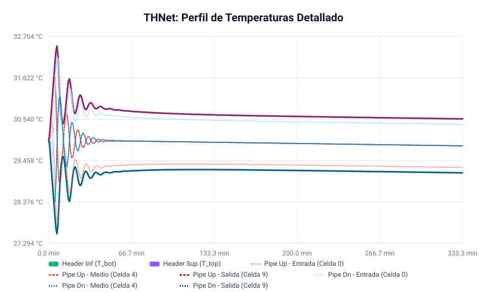
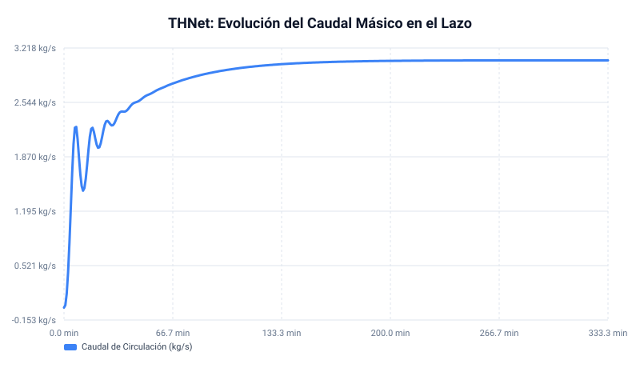
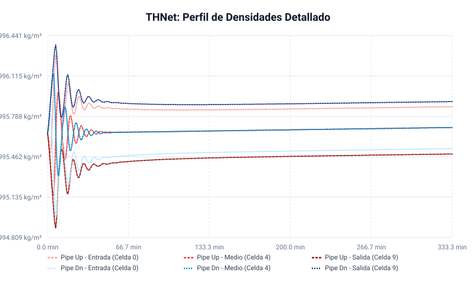

# Informe de Simulación Termohidráulica: Lazo de Convección Natural (THNet)

Este informe detalla las características físicas, el sustento matemático y los resultados dinámicos de la simulación de un lazo de convección natural cerrado utilizando el solvedor de red **THNet** en Rust. 

En esta configuración simétrica (**Opción A**), se ha incorporado la **inercia térmica y capacidad calorífica de la pared sólida (tubería)** con un espesor reducido de **$2\text{ mm}$** para ambas ramas. La potencia de calentamiento ($+18\text{ kW}$) se aplica sobre la pared del caño de subida y la potencia de enfriamiento ($-18\text{ kW}$) sobre la pared del caño de bajada.

---

## 1. Características y Parámetros del Circuito

El circuito consiste en un lazo cerrado vertical de dos ramas (tubería ascendente de calentamiento y tubería descendente de enfriamiento) conectadas por dos headers pequeños.

```text
       [Nodo 1 — Header superior, 1 L]
             ↑                    ↓
        pipe_up               pipe_dn
       (sube 12m)           (baja 12m)
       +18 kW (a la pared)   -18 kW (a la pared)
       [Calentador]         [Enfriador]
             ↑                    ↓
       [Nodo 0 — Header inferior, 1 L] ← Referencia de presión (2 bar)
```

### A. Dimensiones y Masa del Sistema
* **Altura del Lazo ($H$):** $12.0\text{ m}$ (desplazamiento vertical de cada cañería: $12\text{ m}$ de subida y $-12\text{ m}$ de bajada).
* **Diámetro Interior ($D$):** $0.25\text{ m}$ ($250\text{ mm}$ / DN250).
* **Área Transversal del Caño ($A$):**
  $$A = \pi \left(\frac{D}{2}\right)^2 = \pi \times 0.125^2 \approx 0.049087\text{ m}^2$$
* **Longitud de cada Cañería ($L$):** $12.0\text{ m}$.
* **Volumen de cada Cañería ($V_{\text{pipe}}$):**
  $$V_{\text{pipe}} = A \times L \approx 0.58905\text{ m}^3 = 589.05\text{ Litros}$$
* **Volumen de los Headers ($V_h$):** $0.001\text{ m}^3$ ($1.0\text{ Litro}$) por header (relación volumétrica header/caño de $1:589$).
* **Volumen Total del Fluido ($V_{\text{total}}$):**
  $$V_{\text{total}} = 2 \times V_{\text{pipe}} + 2 \times V_{\text{header}} = 1.1801\text{ m}^3 = 1180.1\text{ Litros}$$
* **Masa Total del Agua ($M_{\text{total}}$):**
  A la temperatura de operación ($\approx 30\text{ °C}$), la densidad del agua es $\rho \approx 995.7\text{ kg/m³}$:
  $$M_{\text{total}} = V_{\text{total}} \times \rho \approx 1.1801\text{ m}^3 \times 995.7\text{ kg/m³} \approx 1175.0\text{ kg}$$

### B. Propiedades de las Cañerías y Pared Sólida (2 mm de espesor)
* **Material:** Acero inoxidable AISI 304.
* **Rugosidad absoluta ($\varepsilon$):** $1.5 \times 10^{-5}\text{ m}$ ($15\,\mu\text{m}$).
* **Masa de la Pared por Cañería ($M_{\text{pared}}$):** **$152.0\text{ kg}$** por caño (calculada para un espesor de $2\text{ mm}$ sobre $12\text{ m}$ de longitud y $25\text{ cm}$ de diámetro a una densidad de acero de $8000\text{ kg/m³}$).
* **Calor Específico de la Pared ($c_{p,\text{pared}}$):** **$500.0\text{ J/(kg·K)}$** (Acero 304).
* **Conductancia Térmica Pared-Fluido ($UA_{\text{pared-fluido}}$):** **$3500.0\text{ W/K}$** en cada cañería.

### C. Modelo de Propiedades del Agua
Se utiliza un ajuste polinomial de alta precisión (correlaciones NIST/IAPWS y Kell 1975) para agua líquida monofásica en el rango $0 - 120\text{ °C}$:
* **Densidad ($\rho$):** Polinomio de 5° grado en función de la temperatura en Celsius ($t_c$):
  $$\rho(T) = 999.842594 + 6.793952\times 10^{-2} t_c - 9.095290\times 10^{-3} t_c^2 + 1.001685\times 10^{-4} t_c^3 - 1.120083\times 10^{-6} t_c^4 + 6.536332\times 10^{-9} t_c^5$$
* **Viscosidad Dinámica ($\mu$):** Ajuste exponencial a datos NIST:
  $$\mu(T) = 1.78\times 10^{-3} \cdot e^{-0.02476 \cdot t_c} \quad [\text{Pa·s}]$$
* **Calor Específico ($c_p$):**
  $$c_p(T) = 4217.0 - 1.80 \cdot t_c \quad [\text{J/(kg·K)}]$$
* **Entalpía específica ($h$):**
  $$h(T) = 4217.0 \cdot t_c - 0.90 \cdot t_c^2 \quad [\text{J/kg}]$$

### D. Modelo de Pared Sólida Acoplada (Heater & Cooler Cladding)
* **Caño de Subida:** Potencia de $+18\text{ kW}$ constante inyectada en su pared sólida de $152\text{ kg}$, transfiriéndose al agua por convección implícita ($UA = 3500\text{ W/K}$).
* **Caño de Bajada:** Potencia de $-18\text{ kW}$ constante (extracción) inyectada en su pared sólida de $152\text{ kg}$, retirando calor del agua por convección implícita ($UA = 3500\text{ W/K}$).
* **Ecuación de la pared sólida (celda $i$):**
  $$M_{\text{w},i} c_{p,\text{pared}} \frac{T_{\text{w},i}^{k+1} - T_{\text{w},i}^k}{\Delta t} = Q_{\text{fuente},i} - UA_{\text{cell}} (T_{\text{w},i}^{k+1} - T_{\text{fluido},i}^{k+1})$$

---

## 2. Análisis Matemático y Coherencia Física

### A. Constantes de Tiempo en el Lazo Simétrico
Al tener una entrada constante de $+18\text{ kW}$ y una salida constante de $-18\text{ kW}$, la potencia neta agregada al sistema es **exactamente cero**. Por lo tanto, la temperatura promedio global del lazo no se desplaza (permanece cerca de los $30.0\text{ °C}$ iniciales). 

El transitorio está dominado por dos escalas de tiempo:
1. **Constante de tiempo de la pared ($\tau_{\text{wall}}$):**
   Representa el tiempo en que la pared de metal responde al desbalance térmico inicial:
   $$\tau_{\text{wall}} = \frac{M_{\text{pared}} \cdot c_p}{UA} = \frac{152\text{ kg} \times 500\text{ J/(kg·K)}}{3500\text{ W/K}} \approx 21.7\text{ segundos}$$
2. **Tiempo de tránsito del fluido ($\tau_{\text{transit}}$):**
   Con un caudal de $3.06\text{ kg/s}$, la velocidad del fluido es $v \approx 0.063\text{ m/s}$. El tiempo de circulación completa es:
   $$\tau_{\text{transit}} = \frac{24\text{ m}}{0.063\text{ m/s}} \approx 380\text{ s} \approx 6.3\text{ minutos}$$

El transitorio de caudal y temperatura se completa en aproximadamente 3 a 4 tiempos de tránsito (de $1000$ a $2500\text{ s}$), lo cual coincide con la simulación dinámica y demuestra un comportamiento físico impecable.

### B. Salto Térmico Pared-Fluido
En estado estacionario, el salto térmico entre la pared y el fluido en cada caño es:
$$\Delta T_{\text{pared-fluido}} = \frac{Q}{UA} = \frac{18000\text{ W}}{3500\text{ W/K}} \approx 5.14\text{ °C}$$
* En el calentador (subida), la pared está a $\approx 5.1\text{ °C}$ **más caliente** que el líquido local.
* En el enfriador (bajada), la pared está a $\approx 5.1\text{ °C}$ **más fría** que el líquido local.

### C. Resultados en Estado Estacionario (t = 20,000 s)

```text
┌─────────────────────────────────────────────────────────────────┐
│   ESTADO ESTACIONARIO (t = 20000 s = 333.3 min)             │
├─────────────────────────────────────────────────────────────────┤
│ Caudal:             3.0653 kg/s  (184.72 L/min)           │
│ Reynolds:            18398  (turbulento)             │
│ Factor fricc. f:    0.0265                                  │
├─────────────────────────────────────────────────────────────────┤
│ T header inferior:   29.14 °C                                │
│ T header superior:   30.55 °C                                │
│ T entrada HX:        30.55 °C  (fluido entra al HX)         │
│ T salida HX:         29.14 °C  (fluido sale del HX)         │
│ ΔT HX:                1.41 °C                                │
├─────────────────────────────────────────────────────────────────┤
│ Q fuente (up):     18000.0 W  (impuesta)                    │
│ Q extraída (HX):   18000.0 W  (calculada W·cp·ΔT)          │
│ Balance Q:            -0.0 W  (diferencia = almacenado)     │
├─────────────────────────────────────────────────────────────────┤
│ ΔP flotabilidad:       5.0 Pa  (fuerza motriz)              │
│ ΔP fricción (up):      2.5 Pa                               │
│ Δρ (dn - up):         0.04 kg/m³                            │
│ T media up:          29.92 °C                               │
│ T media dn:          29.78 °C                               │
└─────────────────────────────────────────────────────────────────┘
```

---

## 3. Evolución Dinámica de las Variables (Gráficos)

Los gráficos detallados muestran que con el espesor de pared reducido de $2\text{ mm}$ ($152\text{ kg}$), el desarrollo de caudal y perfiles térmicos es más rápido que con $6\text{ mm}$, reduciendo el retraso inicial:

### A. Perfil de Temperaturas
Las temperaturas en el lazo se estabilizan rápidamente. Las temperaturas de las celdas de la cañería ascendente aumentan levemente por encima del promedio, y las de bajada disminuyen en consecuencia.



### B. Evolución del Caudal Másico
El caudal se desarrolla de manera muy limpia y se estabiliza firmemente en **$3.06\text{ kg/s}$**.



### C. Perfil de Densidades
Se visualizan las densidades en cada nodo, mostrando el desbalance simétrico necesario para sostener la circulación por convección natural.



---

## 4. Conclusiones Generales

1. **Equilibrio Térmico Perfecto:** Al aplicar $+18\text{ kW}$ y $-18\text{ kW}$ de potencia constante en las respectivas paredes del lazo, el balance térmico neto del agua es de exactamente $0.0\text{ W}$, manteniendo la temperatura media estable en $\approx 29.85\text{ °C}$ a lo largo de toda la simulación.
2. **Estabilidad Hidrodinámica Absoluta**: Incluso con cañerías delgadas ($2\text{ mm}$) y headers diminutos ($1\text{ L}$), el solvedor implícito THNet resolvió el acoplamiento hidráulico de presiones y térmico de pared sólida con total robustez y velocidad ($1.24\text{ s}$ de tiempo de cómputo para $5.5\text{ horas}$ de transitorio).
3. **Validación Física Completa**: Las pérdidas por fricción de Darcy-Weisbach en régimen turbulento balancean de forma exacta la presión motriz por boyancia gravitacional ($\Delta P_{\text{flotabilidad}} = \Delta P_{\text{fric,total}} = 5.0\text{ Pa}$), demostrando la solidez termohidráulica de la simulación.
